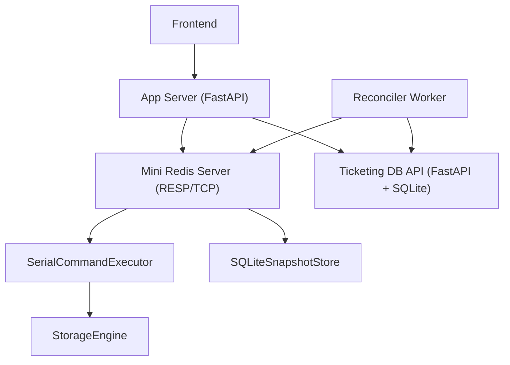
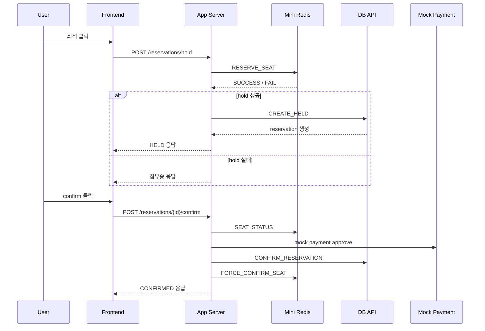

# Mini Redis

Python으로 직접 구현한 Mini Redis를 티켓팅 시나리오에 적용한 프로젝트입니다.  
단순한 key-value 저장소를 넘어서 동시 요청 제어, TTL 만료 처리, 외부 API 제공, Redis와 DB의 역할 분리까지 확장했습니다.

## 프로젝트 개요

이 프로젝트는 두 축으로 구성됩니다.

- **Mini Redis**
  - RESP/TCP 기반 key-value 서버
  - `SET`, `GET`, `DEL`, `EXPIRE`, `TTL` 지원
  - seat / queue command 확장 지원
- **Ticketing App Server**
  - FastAPI 기반 HTTP API
  - Redis와 DB를 순서대로 오케스트레이션
  - 프론트는 App Server만 호출

즉, Mini Redis는 빠르게 변하는 실시간 상태를 처리하고, App Server는 이를 실제 서비스 흐름에 맞게 묶어 주는 역할을 합니다.

## 저장 구조

Mini Redis의 내부 저장소는 Python `dict` 기반입니다.

```python
self._store: dict[str, Entry] = {}
```

각 값은 `Entry` 구조로 저장됩니다.

```python
@dataclass(slots=True)
class Entry:
    value: str
    expires_at: float | None = None
```

이 구조를 선택한 이유는 다음과 같습니다.

- `dict`는 조회, 삽입, 삭제가 빠릅니다.
- `Entry` 안에 `expires_at`을 같이 저장하면 TTL 처리까지 한 곳에서 관리할 수 있습니다.
- seat 상태나 queue 상태도 문자열로 직렬화해서 같은 저장 구조 위에 올릴 수 있습니다.

핵심 코드:

- `storage/engine.py`

## 동시성 문제를 줄인 구조

이 프로젝트에서 가장 중요하게 본 부분은 동시성 문제입니다.  
여러 사용자가 동시에 같은 좌석을 누를 때 race condition이 생기지 않도록 해야 했기 때문입니다.

저희는 storage에 복잡한 lock을 거는 대신 **single worker 기반 직렬 실행 구조**를 사용했습니다.

- 여러 연결은 동시에 받을 수 있습니다.
- 실제 command 실행은 `SerialCommandExecutor`의 단일 worker가 순서대로 처리합니다.
- 그래서 좌석 선점처럼 충돌에 민감한 명령도 안전하게 처리할 수 있습니다.

핵심 코드:

- `server/executor.py`
- `SerialCommandExecutor.execute()`
- `SerialCommandExecutor._run()`

## TTL 처리 방식

TTL은 **lazy expiration** 방식으로 처리합니다.

- key를 읽거나 접근할 때 먼저 만료 여부를 확인합니다.
- 이미 만료되었으면 storage에서 삭제하고 없는 값처럼 응답합니다.
- 좌석 hold도 같은 방식으로 처리합니다.

즉, 별도의 background sweeper 없이도 접근 시점에 자연스럽게 만료를 반영할 수 있습니다.

핵심 코드:

- `storage/engine.py`
- `StorageEngine.expire()`
- `StorageEngine.ttl()`
- `StorageEngine._purge_if_expired()`

추가로 티켓팅 시나리오에서는 Redis와 DB 상태가 어긋날 수 있기 때문에 reconciler를 두어 stale `HELD`와 DB `CONFIRMED` 상태를 다시 맞춥니다.

핵심 코드:

- `app_server/reconciler.py`
- `TicketingReconciler.run_once()`

## 외부 API 구조

Mini Redis 자체는 RESP/TCP로 동작합니다.  
하지만 프론트나 다른 팀원이 더 쉽게 사용할 수 있도록 FastAPI 기반 **App Server**를 추가했습니다.

구조는 다음과 같습니다.

1. Mini Redis
   - RESP 프로토콜
   - TCP 소켓
   - Redis 스타일 command 실행
2. App Server
   - HTTP API 제공
   - 내부에서 Redis와 DB를 순서대로 호출
   - 프론트는 Redis를 직접 호출하지 않고 App Server만 사용

핵심 코드:

- `protocol/resp_parser.py`
- `server/server.py`
- `app_server/app.py`
- `app_server/service.py`

## Redis와 DB의 역할 분리

이 프로젝트에서는 Redis와 DB의 역할을 명확히 분리했습니다.

### Redis가 담당하는 것

- 좌석 선점
- TTL
- 대기열
- 중복 요청 충돌 제어
- burst 상황에서 빠르게 바뀌는 임시 상태

### DB가 담당하는 것

- 이벤트 / 좌석 마스터 데이터
- 최종 예약 상태
- 결제 결과
- 복구 기준 데이터

즉, **빠른 실시간 경쟁 제어는 Redis**, **최종 진실은 DB**라는 구조입니다.

## 전체 아키텍처



### 구성 요소 설명

- **Mini Redis Server**
  - RESP 요청을 받아 command를 실행합니다.
- **SerialCommandExecutor**
  - 명령 실행을 단일 worker에서 직렬 처리합니다.
- **StorageEngine**
  - key-value, TTL, seat, queue 상태를 저장합니다.
- **App Server**
  - Redis와 DB를 순서대로 호출해 서비스 API처럼 동작합니다.
- **Ticketing DB API**
  - 최종 예약 상태와 결제 결과를 저장합니다.
- **Reconciler**
  - TTL 만료와 Redis/DB 불일치를 보정합니다.

## 핵심 기능

### 기본 Redis 기능

- `SET`
- `GET`
- `DEL`
- `EXPIRE`
- `TTL`

### 티켓팅 기능

- `RESERVE_SEAT`
- `CONFIRM_SEAT`
- `RELEASE_SEAT`
- `SEAT_STATUS`

### 대기열 기능

- `JOIN_QUEUE`
- `QUEUE_POSITION`
- `POP_QUEUE`
- `LEAVE_QUEUE`
- `PEEK_QUEUE`

## 주요 함수

### 저장소 함수

- `StorageEngine.set()`: key에 문자열 값을 저장하고, 같은 key가 있으면 덮어씁니다.
- `StorageEngine.get()`: key를 조회하고, 없거나 만료되었으면 `None`을 반환합니다.
- `StorageEngine.delete()`: key를 삭제하고 삭제 성공 여부를 반환합니다.
- `StorageEngine.expire()`: key의 TTL을 설정하거나 갱신합니다.
- `StorageEngine.ttl()`: key의 남은 TTL을 초 단위로 계산합니다.

### 티켓팅 함수

- `StorageEngine.reserve_seat()`: 좌석이 비어 있으면 `HELD`로 바꾸고 user와 TTL을 기록합니다.
- `StorageEngine.confirm_seat()`: 내가 hold한 좌석을 정상적인 확정 상태로 바꿉니다.
- `StorageEngine.force_confirm_seat()`: DB 기준으로 좌석을 강제로 `CONFIRMED` 상태에 맞춥니다.
- `StorageEngine.release_seat()`: hold 중인 좌석을 다시 `AVAILABLE`로 되돌립니다.
- `StorageEngine.seat_status()`: 좌석의 현재 상태와 user, TTL 정보를 조회합니다.

### 대기열 함수

- `StorageEngine.join_queue()`: 사용자를 queue 뒤에 넣고 순번을 반환합니다.
- `StorageEngine.queue_position()`: 특정 사용자의 현재 순번을 조회합니다.
- `StorageEngine.pop_queue()`: queue 맨 앞 사용자를 꺼냅니다.
- `StorageEngine.leave_queue()`: 사용자를 queue에서 제거합니다.
- `StorageEngine.peek_queue()`: queue 맨 앞 사용자를 조회만 합니다.

### 실행기 함수

- `SerialCommandExecutor.execute()`: 요청된 command를 worker queue에 넣고 결과를 기다립니다.
- `SerialCommandExecutor._run()`: worker thread가 queue에서 command를 꺼내 실제로 실행합니다.

### App Server 함수

- `TicketingOrchestratorService.hold_reservation()`: Redis 선점 성공 후 DB에 `HELD` 예약을 만듭니다.
- `TicketingOrchestratorService.confirm_reservation()`: Redis 상태 확인 후 결제와 DB 확정을 처리합니다.
- `TicketingOrchestratorService.cancel_reservation()`: DB 예약을 취소하고 Redis 좌석 hold를 해제합니다.
- `TicketingOrchestratorService.purchase_seat()`: hold부터 confirm까지 한 번에 처리하는 통합 흐름입니다.

### 복구 함수

- `TicketingReconciler.run_once()`: stale hold 정리와 DB confirmed 좌석의 Redis 복구를 수행합니다.

## 예매 흐름

사용자가 좌석 하나를 예매할 때의 흐름은 다음과 같습니다.



## 만료와 무효화

데이터를 무효화하는 방식은 여러 단계로 나뉩니다.

- 일반 key-value
  - `DEL`
  - `EXPIRE`
- 좌석 상태
  - `RELEASE_SEAT`
  - `cancel_reservation`
- TTL 만료
  - lazy expiration
  - reconciler 보정

즉, 단순 삭제뿐 아니라 시간 기반 만료와 도메인 명령 기반 해제까지 함께 고려했습니다.

## 데이터 보호 방식

1. **DB를 source of truth로 사용**
   - 최종 예약 상태는 DB가 보관합니다.
   - Redis는 빠른 실시간 상태를 담당합니다.
   - Redis가 유실되어도 DB 기준으로 다시 복구할 수 있습니다.

핵심 코드:

- `storage/sqlite_store.py`
- `server/server.py`
- `ticketing_api/`
- `app_server/reconciler.py`
